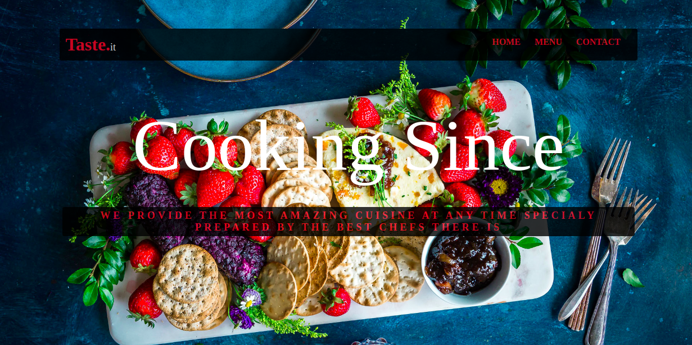

# Restaurant-page

Build a simple restaurant webpage and use JavaScript only to render the content.
# Project Specification

1. Initialise this project.
    - run npm install webpack webpack-cli --save-dev to install webpack to the node_modules directory of your project.
    - Create a src and dist directory with the following contents:
        - an index.js file in src.
        - an index.html file in dist. Go ahead and link the main.js file in a script tag. main.js is the file that will be generated by webpack.
        - create a webpack.config.js and do the basic configurations.
2. Set up an HTML skeleton inside of dist/index.html with single 
.
3. Inside of src/index.js write a simple console.log or alert statement and then run npx webpack. Load up dist/index.html in a browser to make sure everything is working correctly.
4. Create a bare-bones homepage for a restaurant. Include an image, headline, and some copy about how wonderful the restaurant is. It’s okay to hard-code these into the HTML for now just to see how they look on the page.
5. Now remove those elements from the HTML (so leave only the <html>, <body>, and 
 tags) and instead create them by using JavaScript only, e.g. by appending each new element to div#content once the page is first loaded. Since we’re all set up to write our code in multiple files, let’s write this initial page-load function inside of it’s own module and then import and call it inside of index.js.
6. Next, set up your restaurant site to use tabbed browsing to access the Contact and Menu pages. Look at `#7 on this hongkiat post` for visual inspiration.
7. If you are using GitHub pages to host your completed page you need to do a tiny bit more work to get it to show up. After running webpack the full bundled version of your site is available in the dist folder, but GH pages is looking for an index.html in the root directory of your project.

## Built With

- HTML5
- CSS
- Bootstrap
- Javascript ES6
- webpack

## screenshots

### Index Page

## Getting Started

To get a local copy up and running follow these steps:

### Prerequisites

Mozilla Firefox

- Javascript enabled

### Usage

- Fork/Clone this project to your local machine
- Open folder in your local enviroment and run these lines of code to get started:
- Double click on index.html
- To view in IDE just open project folder in your prefered IDE

## Author

👤 **Tendongze Godson**

- Github: [tGodson](https://github.com/tGodson)
- Twitter: [@tendongze95](https://twitter.com/tendongze95)
- Linkedin: [linkedin](https://www.linkedin.com/in/tendongzegodson)

## 🤝 Contributing

Contributions and feature requests are welcome!

Start by:

- Forking the project
- Cloning the project to your local machine
- `cd` into the project directory
- Run `git checkout -b your-branch-name`
- Make your contributions
- Push your branch up to your forked repository
- Open a Pull Request with a detailed description to the development(or master if not available) branch of the original project for a review

## Show your support

Give a ⭐️ if you like this project!

## Acknowledgments

